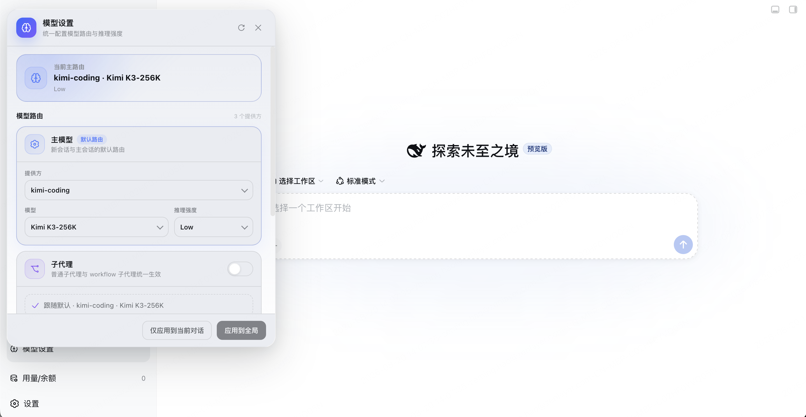

# dsh-model-settings

[中文](README.md) | [English](README.en.md)

## 概述

一个面板统一设置 dsh 里三类独立调用模型的对象：

- **主 agent**（新会话默认模型）
- **子代理**（subagent / workflow 拉起的子任务）
- **goal 回合**（goal 激活期间的回合）

每档独立设置 **provider / 模型 / 推理强度（reasoningEffort）**，保存即热更新，无需重启。

两个动作分清：**应用到全局**写入配置并切换当前对话；**仅应用到当前对话**只切当前会话，不写配置。



## 起源

这个插件的诞生源于一次真实的账单事故。

2026 年 8 月 19 日，作者把 dsh 的主会话切到了 kimi（走订阅，想省点钱）。彼时 DeepSeek 刚推出峰谷计价——白天的账归梁文峰，夜里的价归梁文谷。白天是峰价，按量计费该留到夜里；白天干活，该走套餐。

结果晚上一看余额，DeepSeek 从五十多变成了 -1.6。

排查（解压全部 76 个会话日志逐条核对）后发现：主会话确实是 kimi，但下午拉起的 12 个子代理全部走了 DeepSeek 官方 API（deepseek-v4-flash），前一天晚上还有 40 个，两天合计约 ¥41–52。不是 key 泄露，而是 dsh 的模型路由机制：子代理继承的是创建时的默认模型（`agent-default-model`），不跟随主会话在界面里选的模型。

也就是说：一旦主会话被切到别的模型（比如 kimi），子代理并不会跟随——它们继承的是创建时的默认模型。于是有了这个插件：用一个面板统一控制主模型、子代理、goal 回合的模型与推理强度，保存即热更新。

## 它做什么

在 dsh Web 界面左下角（工作区下方、设置的上面，按拼音排在「用量/余额」之前）新增 **模型设置** 入口，用一个面板统一管住三类独立调用模型的"消费者"：

| 档位 | 管谁 | 什么时候生效 |
| --- | --- | --- |
| 主模型 | 新会话默认（写 `agent-default-model`） | 应用到全局：写全局配置 **+ 立即切换当前对话** |
| 子代理（含 workflow） | 所有子代理请求（`agent/request` 瀑布全局拦截） | 热更新：运行中的会话下一次拉子代理即生效 |
| goal 回合 | goal 激活期间的会话回合 | 热更新：下一个 goal 回合即生效 |

每个档位都可以独立设置 **provider / model / 推理强度（reasoningEffort）**，也可以选择「跟随默认」。

### 两个按钮，别搞混

| 按钮 | 含义 | 一句话 |
| --- | --- | --- |
| **应用到全局** | 写全局配置 **+** 立即把当前对话也切过去 | 现在和未来，都归你管 |
| **仅应用到当前对话** | 只切当前打开的对话，不写配置 | 只改当下，不留后患 |

**热更新**：保存后无需重启 dsh。新会话用新主模型，已运行会话的下一次子代理请求、下一个 goal 回合立即用新配置。

## 环境要求

- **dsh web profile**：面板是 web 端 UI（`dsh.client.platform: "web"`），只在 web profile 下加载。
- **peer 依赖**：

  | 包 | 版本范围 |
  | --- | --- |
  | `@deepseek-ai/cordis` | `^4.0.1` |
  | `@deepseek-ai/dsh-llm` | `>=0.0.1-rc.1 <0.2.0` |
  | `@deepseek-ai/dsh-settings` | `>=0.0.1-rc.1 <0.2.0` |
  | `@deepseek-ai/schemastery` | `>=0.0.1-rc.1 <0.2.0` |

- **必需的宿主服务**：`agents`、`webServer`（服务端），`slots`、`locale`（客户端）。
- **可选服务**，缺失时对应能力降级而不是崩溃：

  | 服务 | 缺失时 |
  | --- | --- |
  | `settings` | 面板可读不可写，保存返回 `settings service unavailable` |
  | `llm` | 模型目录为空，面板显示「没有可配置的模型提供方」 |
  | `agentDefaultModel` | 读不到当前默认模型，主路由显示「尚未设置」 |
  | `goals` | goal 档不生效，其余两档正常 |

## 安装

### 标准安装（推荐）

```bash
# 从 GitHub 安装
dsh plugin --profile web add github:Howthemeaning/dsh-model-settings
```

`dsh plugin` 会把包安装进 profile 并自动把 `dsh-model-settings` 加入 `dsh.profile.bundles` 层（因为本包声明了 `dsh.bundle.patch`）。**重启 dsh** 后生效。

### 卸载

```bash
dsh plugin --profile web remove dsh-model-settings
```

或手动：从 `~/.dsh/profiles/web/package.json` 的 `dsh.profile.bundles` 数组和 `dependencies` 里删掉 `dsh-model-settings`，再删除 `~/.dsh/profiles/web/node_modules/dsh-model-settings`。

## 配置项

日常使用直接开面板即可 —— 面板保存写的是 settings 的用户层，优先级高于下面这些默认值。

如果要在部署时预置默认值（例如团队统一把子代理钉在便宜的模型上），在 profile 的 `~/.dsh/profiles/web/cordis.patch.yml` 里用 `update` 覆盖本插件的 `config`：

```yaml
- update:
    - id: model-settings
      config:
        subagent:
          provider: deepseek-official
          model: deepseek-v4-flash
          reasoningEffort: low
```

两个可选档位，字段相同：

| 字段 | 类型 | 说明 |
| --- | --- | --- |
| `subagent` | object | 子代理（含 workflow 子代理）的覆盖档，缺省为跟随默认 |
| `goal` | object | goal 激活期间会话回合的覆盖档，缺省为跟随默认 |
| `<档>.provider` | string | provider id，与面板「提供方」下拉一致 |
| `<档>.model` | string | model id |
| `<档>.reasoningEffort` | string | 推理强度 id，省略表示用模型默认值 |

主模型档不在这里配 —— 它写的是 `agent-default-model` 命名空间，由面板或 dsh 自身的设置负责。

## 开发

本包是手写 ESM，没有编译步骤：`lib/index.js` 是宿主侧，`lib/client.js` 是浏览器侧（手写 `__ModuleLoader__` bundle，CSS 内联其中）。

peer 依赖由 dsh CLI 自带，本地开发把 `node_modules` 指过去即可：

```bash
ln -sfn "$(npm root -g)/@deepseek-ai/dsh/node_modules" node_modules
npm run check
```

| 命令 | 作用 |
| --- | --- |
| `npm run build` | 校验发布产物齐全，并用 `node --check` 过一遍两个 js（无 transpile） |
| `npm run check` | `build` 之后跑 `test/smoke.mjs` |

`test/smoke.mjs` mock 一个最小 cordis ctx，覆盖 `agent/request` 的档位优先级与三个端点。另外两个是排查工具，不在 check 里：`test/read-log.mjs` 解压并打印会话日志的 `request/header`，`test/render-debug.mjs` 在 node 里强制渲染面板以复现崩溃。

改完 `lib/client.js` 后，把文件同步到已安装副本并硬刷新页面才能看到效果（CSS 在首次加载时注入 `<style>`，但不需要重启 dsh）：

```bash
cp lib/client.js ~/.dsh/profiles/web/node_modules/dsh-model-settings/lib/client.js
```

## License

MIT —— 本插件因一次真实的余额事故而生，希望它能帮你管住每一笔模型开销。
